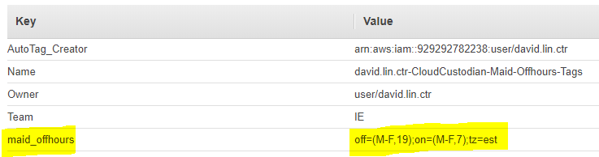
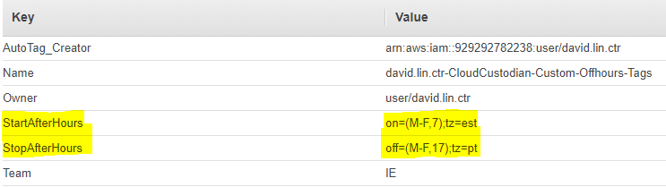

# David Lin's Cloud Custodian Policies 

## Policies in Production

| Policy | Description |
|--------|-------------|
| [offhours.yml](https://github.com/davidclin/cloudcustodian-policies/blob/master/policies/offhours.yml)<br> | Starts and stops instances during offhours via Lambda function. Instances filtered on presence of maid_offhours tag or StartAfterHours/StopAfterHours custom tags. [(See Offhour Examples)](#offhours) |
| [unused-sgroup-audit.yml](https://github.com/davidclin/cloudcustodian-policies/blob/master/policies/unused-sgroup-audit.yml)<br> | Retrieves all unused security groups that match regex, deletes them, then sends notifications.  |
| [s3-public-audit.yml](https://github.com/davidclin/cloudcustodian-policies/blob/master/policies/s3-public-audit.yml)<br> | Sends notification when public S3 bucket is created.  |
| [copy-instance-tags.yml](https://github.com/davidclin/cloudcustodian-policies/blob/master/policies/copy-instance-tags.yml)<br> | Periodically copies tags from EC2 instances to respective EBS volumes. |
| [public-instance-audit.yml](https://github.com/davidclin/cloudcustodian-policies/blob/master/policies/public-instance-audit.yml)<br> | Sends notification when EC2 instance is launched with a Public IP address or attached to a Public subnet. |
| [mfa-audit.yml](https://github.com/davidclin/cloudcustodian-policies/blob/master/policies/mfa-audit.yml) | Sends reminder to Slack channel so users who are in the Administrators group don't forget to enable MFA to comply with business security policies. If MFA remains disabled after 5 days of the user create date, console access is disabled and access keys are deleted. |
| [termination-protection-audit.yml](https://github.com/davidclin/cloudcustodian-policies/blob/master/policies/termination-protection-audit.yml) | Sends email and Slack notification when EC2 instances in whitelist are found with termination protection disabled. |
| [team-tag-ec2-audit.yml](https://github.com/davidclin/cloudcustodian-policies/blob/master/policies/team-tag-ec2-audit.yml) | Retrieves all EC2 instances with absent or empty Team tag and sends notification.	 |
| [team-tag-s3-audit.yml](https://github.com/davidclin/cloudcustodian-policies/blob/master/policies/team-tag-s3-audit.yml) | Retrieves all S3 buckets with absent or empty Team tag and sends notification. |
 [s3-service-limit-audit.yml](https://github.com/davidclin/cloudcustodian-policies/blob/master/policies/s3-service-limit-audit.yml) | Monitors S3 service limits based on user threshhold and sends notifications. |
[s3-server-access-logging.yml](https://github.com/davidclin/cloudcustodian-policies/blob/master/policies/s3-server-access-logging.yml) | Enables S3 server access logging with TargetBucket set to s3-access-log-account_number-region and PrefixTarget set to name of bucket. |
[s3-target-bucket-audit.yml](https://github.com/davidclin/cloudcustodian-policies/blob/master/policies/s3-target-bucket-audit.yml) | Checks S3 server access logging target bucket name is in compliance. Supplements s3-server-access-logging.yml policy |
[s3-prevent-bucket-creation.yml](https://github.com/davidclin/cloudcustodian-policies/blob/master/policies/s3-prevent-bucket-creation.yml) | Prevents creation of S3 buckets. |
[ebs-autocleanup-tag.yml](https://github.com/davidclin/cloudcustodian-policies/blob/master/policies/ebs-autocleanup-tag.yml) | Tags ebs volume with name 'AutoCleanup' and sets value to 'false' unless volume is already tagged with 'true'. This policy is used with the ebs-garbage-collection policy. | 
[ebs-garbage-collection-with-tags.yml](https://github.com/davidclin/cloudcustodian-policies/blob/master/policies/ebs-garbage-collection-with-tags.yml) | Deletes unattached EBS volumes older than 1 day (24hrs) that have the tag AutoCleanup set to true. |
[iam-ec2-policy-check.yml](https://github.com/davidclin/cloudcustodian-policies/blob/master/policies/iam-ec2-policy-check.yml) | Checks IAM policies that have EC2 related full access permissions. |
[iam-user-audit.yml](https://github.com/davidclin/cloudcustodian-policies/blob/master/policies/iam-user-audit.yml) | Monitors IAM users not in Ec2InstanceLaunchers group but found with AmazonEC2FullAccess managed policy attached. |
[iam-role-with-managed-policy-audit.yml](https://github.com/davidclin/cloudcustodian-policies/blob/master/policies/iam-role-with-managed-policy-audit.yml) | Monitors IAM roles with the AmazonEC2FullAccess managed policy among others. |
[iam-user-administrator-access-audit.yml](https://github.com/davidclin/cloudcustodian-policies/blob/master/policies/iam-user-administrator-access-audit.yml) | Monitors non-whitelisted IAM users with Administrator access. |
[iam-user-tagged-resources-audit.yml](https://github.com/davidclin/cloudcustodian-policies/blob/master/policies/iam-user-tagged-resources-audit.yml) | Retrieves list of AWS resources that belong to tag:Owner |

## Shell Scripts
| Script | Description |
|--------|-------------|
[report.sh](https://github.com/davidclin/cloudcustodian-policies/blob/master/scripts/report.sh) | Invokes iam-user-tagged-resources-audit.yml then writes reports to file.|


## Policies in Test
| Policy | Description |
|--------|-------------|
| [ec2.yml](https://github.com/davidclin/cloudcustodian-policies/blob/master/policies/ec2.yml) | Retrieves instances that match on specified tag name and instance type.  |
| [elasticsearch-find-all-domains.yml](https://github.com/davidclin/cloudcustodian-policies/blob/master/policies/elasticsearch-find-all-domains.yml) | Finds Elasticsearch domaina and retrieves attributes.  |
| [new-user-audit.yml](https://github.com/davidclin/cloudcustodian-policies/blob/master/policies/new-user-audit.yml) | Retrieves iam users in specified group with MFA disabled in the last 30 days  |
| [termination-protection-list.yml](https://github.com/davidclin/cloudcustodian-policies/blob/master/policies/termination-protection-list.yml) | Retrieves list of all EC2 instances with termination protection enabled. |
| [security-groups-unused.yml](https://github.com/davidclin/cloudcustodian-policies/blob/master/policies/security-groups-unused.yml) | Retrieves unused security groups using regex |
| [stopped-instances.yml](https://github.com/davidclin/cloudcustodian-policies/blob/master/policies/stopped-instances.yml) | Retrieves list of all stopped instances in specific VPC. Can be further customized to match other criteria. |
| [security-groups-unused-notify.yml](https://github.com/davidclin/cloudcustodian-policies/blob/master/policies/security-groups-unused-notify.yml) | Retrieves unused security groups using regex and notifies via email |
| [iam.yml](https://github.com/davidclin/cloudcustodian-policies/blob/master/policies/iam.yml)                    | Retrieves iam users using regex |
| [mfa.yml](https://github.com/davidclin/cloudcustodian-policies/blob/master/policies/mfa.yml)                    | Retrieves iam users with MFA enabled |
| [roles.yml](https://github.com/davidclin/cloudcustodian-policies/blob/master/policies/roles.yml)                  | Retrieves unused roles on EC2, Lambda, and ECS |
| [admin-group.yml](https://github.com/davidclin/cloudcustodian-policies/blob/master/policies/admin-group.yml)            | Retrieves users in the group named 'Administrators' |
| [mfa-unused.yml](https://github.com/davidclin/cloudcustodian-policies/blob/master/policies/mfa-unused.yml)             | Retrieves users who have MFA disabled in the group named 'Administrators' |
| [emailer.yml](https://github.com/davidclin/cloudcustodian-policies/blob/master/policies/emailer.yml)                | Sends email notification via Simple Email Service (SES) using notify action |
| [ebs-garbage-collection.yml](https://github.com/davidclin/cloudcustodian-policies/blob/master/policies/ebs-garbage-collection.yml) | Deletes all unattached volumes |
| [ebs-garbage-collection-lambda.yml](https://github.com/davidclin/cloudcustodian-policies/blob/master/policies/ebs-garbage-collection-lambda.yml) | Deletes all unattached volumes using Lambda function |
| [public-subnet-instance-audit-notify.yml](https://github.com/davidclin/cloudcustodian-policies/blob/master/policies/public-subnet-instance-audit-notify.yml) | Sends email notification via SES when EC2 instance launches in a public subnet |
| [public-subnet-instance-audit-whitelist.yml](https://github.com/davidclin/cloudcustodian-policies/blob/master/policies/public-subnet-instance-audit-whitelist.yml) | Lambda that sends email notification via SES when EC2 instance launches in a public subnet and is NOT in the whitelist |
| [mark-unused-sgroups.yml](https://github.com/davidclin/cloudcustodian-policies/blob/master/policies/mark-unused-sgroups.yml) | Mark unused security groups for deletion after N days ; to be used with delete-marked-sgroups.yml |
| [delete-marked-sgroups.yml](https://github.com/davidclin/cloudcustodian-policies/blob/master/policies/delete-marked-sgroups.yml) | Unmarks used security groups that were marked for deletion then deletes remaining marked security |
| [slack-notify.yml](https://github.com/davidclin/cloudcustodian-policies/blob/master/policies/slack-notify.yml) | Slack example |

# Cloud Custodian Architecture and AWS Services


# Getting Started
<details>
<summary>Quick Install</summary>

```
*** Install repository***
$ git clone https://github.com/capitalone/cloud-custodian

*** Install dependencies (with virtualenv) ***
$ virtualenv c7n_mailer
$ source c7n_mailer/bin/activate
$ cd cloud-custodian/tools/c7n_mailer
$ pip install -r requirements.txt

Note: If you upgrade PIP and encounter issues related to "pip ImportError: cannot import name 'main' after update",
save yourself some grief and simply remove /usr/bin/pip and re-install pip.

*** Install extensions ***
$ python setup.py develop

*** Verify Installation ***
$ c7n-mailer
$ custodian

*** Upgrade AWS CLI ***
$ sudo pip install awscli --upgrade

```
For more info, check out [Cloud Custodian in GitHub](https://github.com/capitalone/cloud-custodian)
</details>

# Usage
<details>
<summary>Getting Started</summary>

<pre>
Cloud Custodian must be run within a virtual environment.

$ cd ~
$ virtualenv c7n_mailer/bin/activate
$ cd cloudcustodian  (this is the IE/cloudcustodian repo where all the policies reside)

As a test, try
$ custodian run -s out mfa.yml
$ custodian report -s out mfa.yml --format grid

Cloud Custodian will create a log file in the ~/cloudcustodian/out/ subdirectory IF there are any matches. 
</pre>
</details>

# Environment Settings
<details>
<summary>mailer.yml</summary>

<pre>
# Which queue should we listen to for messages
queue_url: https://sqs.us-east-1.amazonaws.com/1234567890/sandbox

# Default from address
from_address: email@address.com

# Tags that we should look at for address infomation
contact_tags:
  - OwnerContact
  - OwnerEmail
  - SNSTopicARN

# Standard Lambda Function Config
region: us-east-1
role: arn:aws:iam::1234567890:role/CloudCustodianRole
slack_token: xoxb-bot_token_string_goes_here
</pre>
</details>

<details>
<summary>Cloud Custodian Lambda AWS Role</summary>
 
<pre>
Note: Based on your use case, additional permissions may be needed. 
Cloud Custodian will generate a msg if that is the case after invocation.

Trust relationship:
"Service": "lambda.amazonaws.com"

General policy permissions:
health:DescribeEvents
health:DescribeEventDetails
health:DescribeAffectedEntities
iam:PassRole
iam:ListAccountAliases
iam:ListUsers
iam:ListRoles
iam:ListAttachedRolePolicies
iam:GetCredentialReport
iam:GenerateCredentialReport
iam:ListAttachedUserPolicies
iam:GetPolicy
ses:SendEmail
ses:SendRawEmail
lambda:CreateFunction
lambda:ListTags
lambda:GetFunction
lambda:AddPermission
lambda:ListFunctions
lambda:UpdateFunctionCode
lambda:CreateAlias
events:DescribeRule
events:PutRule
events:ListTargetsByRule
events:PutTargets
events:ListTargetsByRule
tag:GetResources
cloudwatch:CreateLogGroup
cloudwatch:CreateLogStream
autoscaling:DescribeLaunchConfigurations
s3:GetBucketLocation
s3:GetBucketTagging
s3:GetBucketPolicy
s3:GetReplicationConfiguration
s3:GetBucketVersioning
s3:GetBucketNotification  
s3:GetLifeCycleConfiguration
s3:ListAllMyBuckets
s3:GetBucketAcl
s3:GetBucketWebsite
s3:GetBucketLogging 
s3:DeleteBucket 
s3:PutBucketTagging
es:DescribeElasticsearchDomains
es:ListDomainsNames
es:ListTags
es:AddTags
</pre>
</details>

<details>
<summary>Slack Oauth Permissions for App with Bot User</summary>
  
<pre>
incoming-webhook
channels:history
channels:read
chat:write:bot
chat:write:user
groups:history
groups:read
im:write
users:read
users:read.email
</pre>
</details>

# Schemas Used
<details>
<summary>ebs</summary>

<pre>
(custodian) [hostname]$ custodian schema ebs
aws.ebs:
  actions: [auto-tag-user, copy-instance-tags, delete, detach, encrypt-instance-volumes,
    invoke-lambda, mark, mark-for-op, modify, normalize-tag, notify, post-finding,
    put-metric, remove-tag, rename-tag, snapshot, tag, tag-trim, unmark, untag]
  filters: [and, config-compliance, event, fault-tolerant, health-event, instance,
    kms-alias, marked-for-op, metrics, modifyable, not, or, tag-count, value]
</pre>
</details>

<details>
<summary>ec2</summary>
<pre>

(custodian) [hostname]$ custodian schema ec2
aws.ec2:
  actions: [auto-tag-user, autorecover-alarm, invoke-lambda, mark, mark-for-op, modify-security-groups,
    normalize-tag, notify, post-finding, propagate-spot-tags, put-metric, reboot,
    remove-tag, rename-tag, resize, set-instance-profile, snapshot, start, stop, tag,
    tag-trim, terminate, unmark, untag]
  filters: [and, config-compliance, default-vpc, ebs, ephemeral, event, health-event,
    image, image-age, instance-age, instance-attribute, instance-uptime, marked-for-op,
    metrics, network-location, not, offhour, onhour, or, security-group, singleton,
    state-age, subnet, tag-count, termination-protected, user-data, value, vpc]
</pre>
</details>

<details>
<summary>elasticsearch</summary>

<pre>
aws.elasticsearch:
  actions: [auto-tag-user, delete, invoke-lambda, mark-for-op, modify-security-groups,
    notify, post-finding, put-metric, remove-tag, tag]
  filters: [and, event, marked-for-op, metrics, not, or, security-group, subnet, value,
    vpc]
</pre>
</details>

<details>
<summary>iam-role</summary>

<pre>
(custodian) [hostname]$ custodian schema iam-role
aws.iam-role:
  actions: [invoke-lambda, notify, put-metric]
  filters: [and, event, has-inline-policy, has-specific-managed-policy, no-specific-managed-policy,
    not, or, unused, used, value]
</pre>
</details>

<details>
<summary>iam-user</summary>

<pre>
(custodian) [hostname]$ custodian schema iam-user
aws.iam-user:
  actions: [delete, invoke-lambda, notify, put-metric, remove-keys]
  filters: [access-key, and, credential, event, group, mfa-device, not, or, policy,
    value]
</pre>
</details>

<details>
<summary>s3</summary>

<pre>
(custodian) [hostname]$ custodian schema s3
aws.s3:
  actions: [attach-encrypt, auto-tag-user, configure-lifecycle, delete, delete-bucket-notification,
    delete-global-grants, encrypt-keys, encryption-policy, invoke-lambda, mark-for-op,
    no-op, notify, post-finding, put-metric, remove-statements, remove-website-hosting,
    set-bucket-encryption, set-inventory, set-statements, tag, toggle-logging, toggle-versioning,
    unmark]
  filters: [and, bucket-encryption, bucket-notification, config-compliance, cross-account,
    data-events, event, global-grants, has-statement, inventory, is-log-target, marked-for-op,
    metrics, missing-policy-statement, missing-statement, no-encryption-statement,
    not, or, value]

</pre>
</details>

<details>
<summary>security-group</summary>

<pre>
(custodian) [hostname]$ custodian schema security-group
aws.security-group:
  actions: [auto-tag-user, delete, invoke-lambda, mark, mark-for-op, normalize-tag,
    notify, patch, put-metric, remove-permissions, remove-tag, rename-tag, tag, tag-trim,
    unmark, untag]
  filters: [and, default-vpc, diff, egress, event, ingress, json-diff, locked, marked-for-op,
    not, or, stale, tag-count, unused, used, value]
</pre>
</details>

# Artifacts
<details>
<summary>security-groups-unused.yml</summary>

<pre>
(custodian) [hostname]$ custodian run --dryrun -s . security-groups-unused.yml
2018-04-13 20:02:01,043: custodian.policy:INFO policy: security-groups-unused resource:security-group region:us-east-1 count:29 time:0.30

(custodian) [hostname]$ more ./security-groups-unused/resources.json | grep 'GroupName\|GroupId'
(custodian) [hostname]$ more ./security-groups-unused/resources.json | grep GroupName\"\:
    "GroupName": "rds-launch-wizard-5",
    "GroupName": "rds-launch-wizard",
    "GroupName": "rds-launch-wizard-2",
    "GroupName": "launch-wizard-17",
    "GroupName": "launch-wizard-5",
    "GroupName": "launch-wizard-7",
    "GroupName": "launch-wizard-6",
    "GroupName": "launch-wizard-1",
    "GroupName": "rds-launch-wizard-4",
    "GroupName": "launch-wizard-4",
    "GroupName": "launch-wizard-2",
    "GroupName": "launch-wizard-3",
    etc.
</pre>
</details>

<details>
<summary>iam.yml</summary>

<pre>
(custodian) [ec2-user@ip-10-100-0-195 custodian]$ custodian run --dryrun -s . iam.yml
2018-04-13 22:51:05,472: custodian.policy:INFO policy: iam-user-filter-policy resource:iam-user region:us-east-1 count:1 time:0.01

(custodian) [hostname]$ more ./iam-user-filter-policy/resources.json | grep UserName\"\:
    "UserName": "david.lin",
</pre>
</details>

<details>
<summary>mfa.yml</summary>

<pre>
(custodian) [hostname]$ custodian run --dryrun mfa.yml -s .
2018-04-13 23:47:40,901: custodian.policy:INFO policy: mfa-user-filter-policy resource:iam-user region:us-east-1 count:15 time:0.01

(custodian) [hostname]$ more ./mfa-user-filter-policy/resources.json | grep UserName\"\:
    "UserName": "username_1",
    "UserName": "username_2,
    "UserName": "username_3",
    "UserName": "username_4",
     etc.
</pre>
</details>

<details>
<summary>roles.yml</summary>

<pre>
(custodian) [hostname]$ custodian run --dryrun roles.yml -s .
2018-04-14 07:11:22,425: custodian.policy:INFO policy: iam-roles-unused resource:iam-role region:us-east-1 count:55 time:1.92

(custodian) [hostname]$ more ./iam-roles-unused/resources.json | grep RoleName
    "RoleName": "AmazonSageMaker-ExecutionRole-20180412T161207",
    "RoleName": "autotag-AutoTagExecutionRole-KA3LH5ARKJ2E",
    "RoleName": "autotag-AutoTagMasterRole-3VSL2AF3480E",
    "RoleName": "AWS-Cloudera-Infrastructu-ClusterLauncherInstanceR-1HUTDQJUYVGVE",
    etc.
</pre>
</details>

<details>
<summary>admin-group.yml</summary>

<pre>
(custodian) [hostname]$ custodian run --dryrun admin_group.yml -s .
2018-04-14 07:54:08,198: custodian.policy:INFO policy: iam-users-in-admin-group resource:iam-user region:us-east-1 count:14 time:3.67

(custodian) [hostname]$ more ./iam-users-in-admin-group/resources.json | grep UserName
    "UserName": "username_1",
    "UserName": "username_2",
    "UserName": "username_3",
    "UserName": "username_4",
    etc.
</pre>
</details>

<details>
<summary>mfa-unused.yml</summary>

<pre>
(custodian) [hostname]$ custodian run --dryrun mfa-unused.yml -s .
2018-04-14 08:13:07,214: custodian.policy:INFO policy: mfa-unused resource:iam-user region:us-east-1 count:2 time:2.54

(custodian) [ec2-user@ip-10-100-0-195 custodian]$ more ./mfa-unused/resources.json | grep UserName
    "UserName": "username_1",
    "UserName": "username_2"
</pre>
</details>

<details>
<summary>emailer.yml</summary>

<pre>
(custodian) [hostname]$ custodian run -s . emailer.yml
2018-04-23 22:25:12,614: custodian.policy:INFO policy: mfa-unused resource:iam-user region:us-east-1 count:2 time:8.41
2018-04-23 22:25:12,812: custodian.actions:INFO sent message:71ba67dd-731a-4734-bf63-15991754249e policy:mfa-unused template:default.html count:2
2018-04-23 22:25:12,813: custodian.policy:INFO policy: mfa-unused action: notify resources: 2 execution_time: 0.20
</pre>
</details>

<details>
<summary>public-subnet-instance-audit-notify.yml</summary>
<pre>
(custodian) $ custodian run -s . public-subnet-instance-audit-notify.yml
2018-05-04 01:07:56,937: custodian.policy:INFO Provisioning policy lambda public-subnet-instance-audit-notification
</pre>
</details>

# Usage Considerations
<a name="offhours"></a><details>
<summary>Offhour Examples</summary>

<pre>
-------------------------------------------------------
Option 1: Using a Single Tag with key = "maid_offhours"
-------------------------------------------------------
# up mon-fri from 7am-7pm; eastern time
off=(M-F,19);on=(M-F,7);tz=est
# up mon-fri from 6am-9pm; up sun from 10am-6pm; pacific time
off=[(M-F,21),(U,18)];on=[(M-F,6),(U,10)];tz=pt



---------------------------------------------------------------------
Option 2: Using Tags with Names "StartAfterHours" and "StopAfterHours"
---------------------------------------------------------------------
# Using key "StartAfterHours"
# up mon-fri starting 7am; eastern time
on=(M-F,7);tz=est

#Using key "StopAfterHours"
# off mon-fri after 5pm; pacific time
off=(M-F,17);tz=pt



Important Note: When you stop an instance, the data on any instance store volumes is erased. 
                Therefore, if you have any data on instance store volumes that you want to 
                keep, be sure to back it up to persistent storage.

More Examples : http://capitalone.github.io/cloud-custodian/docs/quickstart/offhours.html#offhours
</pre>
</details>

<details>
<summary>Other Misc Usage Considerations</summary>

*copy-tag* and *tag-team* policies require addtional enhancements that were added to c7n/tags.py.
A modified version that tracks these changes can be found [here](https://github.com/capitalone/cloud-custodian/compare/master...mikegarrison:master).

*emailer.yml* requires the custodian mailer described [here](https://github.com/capitalone/cloud-custodian/tree/master/tools/c7n_mailer). 

*ebs-garbage-collection.yml* can be run across all regions with the --region all option.<p>
 
 For example: <br>
 
```
 custodian run --dryrun -s out --region all ebs-garbage-collection.yml
```
</details>

<details>
<summary>More</summary>

*offhours.yml* is run as a Lambda with CloudWatch periodic scheduler. It filters for EC2 instances tagged with "maid_offhours"
and obeys rules set forth in the corresponding value pair per [Cloud Custodian Offhours Policy](http://capitalone.github.io/cloud-custodian/docs/quickstart/offhours.html#offhours). When specifying on/off/tz values, the values in the policies are overrided by the EC2 instance maid_offhours tag. So you can set the onhour/offhour to anything in the policy and it will not do anything.  

*emailer.yml* requires the custodian mailer described [here](https://github.com/capitalone/cloud-custodian/tree/master/tools/c7n_mailer). 

*ebs-garbage-collection.yml* can be run across all regions with the --region all option.<p>
 
 For example: <br>
 
```
 custodian run --dryrun -s out --region all ebs-garbage-collection.yml
```
</details>

# Troubleshooting Tips
Use 'custodian validate' to find syntax errors<br>
Check 'name' of policy doesn't contain spaces<br>
Check SQS to see if Custodian payload is entering the queue<br>
Check SQS permissions permit other accounts if using c7n-org
Check cloud-custodian-mailer lambda CloudWatch rule schedule (5 minute by default)<br>
Check Lambda error logs (this requires CloudWatch logging)<br>
Check role for lambda(s) have adequate permissions<br>
Remember to update the cloud-custodian-mailer lambda when making changes to a policy that uses notifications<br>
Clear the cache if you encounter errors due to stale information (rm ~/.cache/cloud-custodian.cache)<br>

# How to decode SQS msg
<pre>
Grab one of the email messages in the c7n mailer SQS queue before it gets picked up and then unzip and base64 decode it.
You can see the entire metadata file with all the available info being passed to the mailer. 

To get the plan text:
Copy the encoded SQS message into a file (e.g. result)
Then decode the text using:
$ cat result | base64 -d > result.zlib
$ printf "\x1f\x8b\x08\x00\x00\x00\x00\x00" | cat - result.zlib | gzip -dc

The printf is just to pad a proper header for gzip. Otherwise gzip will not be able to uncompress it.

*Taken from https://groups.google.com/d/msg/cloud-custodian/z67zuVApHp0/xX81toqVAgAJ
</pre>

# Log Messages
If you see the following CloudWatch log when sending notifications via Slack, ignore it:<br>

<pre>
[WARNING]	2018-06-06T23:42:21.321Z	413b5506-69e3-11e8-8a8c-6f167e23dc1a	Error: An error occurred (InvalidCiphertextException) when calling the Decrypt operation: Unable to decrypt slack_token with kms, will assume plaintext.
</pre>

# Canned Code Cheatsheet
<details>
<summary>Invoking Lambda Funtions</summary>

```
mode:
  type: cloudtrail
  role: arn:aws:iam::929292782238:role/CloudCustodian
  events:
    - CreateBucket
```

```
mode:
  type: periodic
  role: arn:aws:iam::929292782238:role/CloudCustodian
  schedule: "rate(15 minutes)"```
```

```
mode:
  type: periodic
  schedule: "rate(1 day)"
  role: arn:aws:iam::123456789012:role/lambda-role
  execution-options:
    assume_role: arn:aws:iam::123123123123:role/target-role
    metrics_enabled: false
```

</details>

<details>
<summary>Sending Notifications via SES and Slack</summary>
  
```
actions:
 - type: notify
   template: default.html
   slack_template: slack-default
   template_format: 'html'
   priority_header: '5'
   subject: 'Security Audit: Unused Security Groups'
   to:
     - <your-email-address-goes-here>
     - slack://#<slack-channel-name>
   owner_absent_contact:
     - <your-emails-address-goes-here>
   transport:
     type: sqs
     queue: https://sqs.us-east-1.amazonaws.com/1234567890/cloud-cloudcustodian
```
</details>

<details>
<summary>Filtering with regex and whitelist</summary>
  
```
filters:
  - not:
    - type: value
      key: "tag:Name"
      value: (MyJenkinsInstance|MyCloudCustodianInstance)
      op: regex
  - and:
    - type: subnet 
      key: "tag:Name"
      value: "david.lin-subnet" 
```
</details>

# Updating Latest Changes to Message Templates
When you make changes to a message template and you've deployed the Lambda mailer,
you will need to update the mailer.

```
c7n-mailer --config mailer.yml --update-lambda
```

# Updating Latest Merges to Master
From your virtualenv

```
cd ~/cloud-custodian
git pull
python setup.py install
```
This will reflect changes in your virtualenv Python lib such that the schema validation uses the latest fixes/updates.

# Running Policy as Cron Job
<details>
  <summary>See Example</summary>
  
  <b>crontab</b>
  <pre>
  $ crontab -l
  # Run job every day at 5 pm PST.
  # Clean log at 23:00 pm PST every month to save disk space.
  * 17 * * * /home/ubuntu/cloudcustodian/cron/mfa-audit.sh > /home/ubuntu/cloudcustodian/logs/mfa-audit.log 2>&1
  * 23 * 1-12 * /home/ubuntu/cloudcustodian/cron/cleanlogs.sh
  </pre>

  <b>mfa-audit.sh</b>
  <pre>
  $ pwd
  /home/ubuntu/cloudcustodian-policies/cron
  $ more mfa-audit.sh
  #!/bin/bash
 PATH=/home/ubuntu/bin:/home/ubuntu/.local/bin:/usr/local/sbin:/usr/local/bin:/usr/sbin:/usr/bin:/sbin:/bin:/usr/games:/usr/local/games:/snap/bin
  export PATH
  source c7n_mailer/bin/activate
  echo "Running policy..."
  c7n-mailer --config /home/ubuntu/cloudcustodian-policies/mailer.yml --update-lambda && custodian run -c /home/ubuntu/cloudcustodian-policies/mfa-audit.yml -s output
  echo "MFA policy run completed"
  </pre>
  
  <b>cleanlogs.sh</b>
  <pre>
  $ pwd
  /home/ubuntu/cloudcustodian-policies/cron
  $ more cleanlogs.sh
  #!/bin/bash
      PATH=/home/ubuntu/bin:/home/ubuntu/.local/bin:/usr/local/sbin:/usr/local/bin:/usr/sbin:/usr/bin:/sbin:/bin:/usr/games:/usr/local/games:/snap/bin
  export PATH
  echo "Cleaning logs ..."
  rm /home/ubuntu/cloudcustodian/logs/mfa-audit.log
  echo "Log files deleted!"
  </pre>
  
  Useful Tool: <a href="https://crontab.guru/">Quick simple editor for cron schedule expressions.</a>
</details>

# Lambda Policies 101
Lambda policies can get confusing in a hurry. My advice. RTFM before diving into the weeds!

[Lambda Policies](https://www.capitalone.io/docs/policy/lambda.html#execution-options)

Supported Lambda Mode Types:
- cloudtrail
- ec2-instance-state
- periodic
- config-rule

<pre>
When using execution-options:
- Metrics are pushed using the assumed role which may or may not be desired. Use 'metrics_enabled: false' to disable if not desired.
- The mode must be periodic as there are restrictions on where policy executions can run according to the module:
  -- Config: May run in a different region but NOT cross-account
  -- Event: Only run in the SAME region and account
  -- Periodic: May run in a different region AND different account (this is the most flexible)
</pre>

# Cross-Account Notes
- Cross account is supported in the c7n_org tool via the c7n-org CLI command.
- c7n-org supports multiple regions via the --region option (i.e. --region all).
- c7n-org can manage policies across different accounts and restrict the execution of policy by tag [(See more)](https://github.com/capitalone/cloud-custodian/tree/master/tools/c7n_org).

```
Example:
(c7n_org) $ c7n-org run -s output -c accounts.yml -u c7n-org-public-instance-audit.yml --region us-west-1 -a "Sandbox"
2018-07-19 18:09:04,624: c7n_org:INFO Ran account:Sandbox region:us-west-1 policy:c7n-org-public-instance-audit matched:17 time:2.88
2018-07-19 18:09:04,633: c7n_org:INFO Policy resource counts Counter({'c7n-org-public-instance-audit': 17})
```

- c7n_org includes a tool that auto generates the config file c7n-org uses for accounts using the aws organizations API.
- To run policies across multiple AWS accounts, create roles in the cross-accounts that trust a 'primary/governance' account and from the primary/governance account create an instance profile that has the STS assume role to switch to N other accounts.
- To send email/Slack notifications using the existing SQS mailer queue, add permission to the SQS mailer queue that allows cross-accounts.
- c7n-org gets credentials from the [default] section of the ~/.aws/credentials and ~/.aws/config files.
  Support for [profile](https://github.com/capitalone/cloud-custodian/issues/1956) as part of the account config was later introduced in Feb 2018.
- The cache file can handle multiple regions but you need a separate cache for each account (i.e. --cache /home/custodian/.accountname.cache)
- Policies can be run locally on EC2 instance or via Lambdas (or containers on k8s/ECS although I haven't tried this)

<pre>
Jamison Roberts @jtroberts83 14:13
@davidclin If you grab one of the email messages in the c7n mailer SQS queue before it gets picked up and then unzip and base64 decode it you can see the entire metadata file with all the available info being passed to the mailer. Check that metadata to see if it shows the account numbers for the resources you are looking at. If so we can assist some with the email template to get those printed
@davidclin

To get the plan text:
Copy the encoded SQS message into a file (e.g. result)
Then decode the text using:
$ cat result | base64 -d > result.zlib
$ printf "\x1f\x8b\x08\x00\x00\x00\x00\x00" | cat - result.zlib | gzip -dc
The printf is just to pad a proper header for gzip. Otherwise gzip will not be able to uncompress it.

*Taken from https://groups.google.com/d/msg/cloud-custodian/z67zuVApHp0/xX81toqVAgAJ
</pre>

# Cross-Account Questions
- How are Lambda policies run across accounts?
  The same but you need to remove ```role:``` under the mode section.
  In addition, the CloudCustodian role assigned to the c7n-org instance requires **sts:AssumeRole** and the role being assumed in the other account(s) must **trust** the CloudCustodian role assigned to the c7n-org.   
  
- How is Lambda policy sprawl managed across accounts?
  [TBD]

# Email and Slack Message Templates
The default email and slack templates will show the primary account ID by default.
In order to have the templates show cross account ID's, you need to include the variable name 'account_id'.

Email Template Example:
```

     <h2><font color="#505151"> Account {{  "%s - %s" | format(account,region)  }} </h2>

     <h2><font color="#505151"> Cross Account {{ "%s - %s" | format(account_id,region)  }} </h2>

```

Slack Template Example:
```
{
   "title":"Account ID",
   "value":"{{ account_id }}"
},
{
   "title":"Region",
   "value":"{{ region }}"
},
```

# General Policy Notes
Cloud Custodian policies can be run
  - serverless as separate Lambdas per account per region
  - as EC2 instance via cron job
  - as EC2 instance via c7n-org 
  - as container via ECS Fargate c7n-org
  - Cross account Lambda policies are not supported per [Issue #1071](https://github.com/capitalone/cloud-custodian/issues/1071)
    But was recently support per [Issue #2533 ](https://github.com/capitalone/cloud-custodian/issues/2533)
  - Support for cross-account CloudWatch events is supported per [Issue #2005](https://github.com/capitalone/cloud-custodian/pull/2005)
    but requires an AWS CloudWatch footprint in each cross-account which can be stood up using CloudFormation


# Resources
[Custom msg-templates for c7n_mailer](https://github.com/capitalone/cloud-custodian/issues/1127)<br>
[Slack API and Token](https://github.com/capitalone/cloud-custodian/issues/2340)<br>
[Using ec2-instance-state, lessons around roles, how to view lambda logs, and more](https://github.com/capitalone/cloud-custodian/issues/2321)<br>
[How does garbage collection get enforced?](https://github.com/capitalone/cloud-custodian/issues/2384)<br>
[EC2 Offhours Support](http://capitalone.github.io/cloud-custodian/docs/usecases/ec2offhours.html#ec2offhours)<br>
[Example offhours support](http://capitalone.github.io/cloud-custodian/docs/quickstart/offhours.html)<br>
[Lambda Support](http://capitalone.github.io/cloud-custodian/docs/policy/lambda.html)<br>
[AWS CloudWatch Schedule Rules](https://docs.aws.amazon.com/AmazonCloudWatch/latest/events/ScheduledEvents.html)<br>
[iam-user feature enhancement](https://github.com/capitalone/cloud-custodian/pull/2454)<br>
[Offhours Examples](http://capitalone.github.io/cloud-custodian/docs/quickstart/offhours.html)<br>
[CloudWatch Rules Expressions](https://docs.aws.amazon.com/AmazonCloudWatch/latest/events/ScheduledEvents.html)<br>
[Adding Custom Fields to Reports](http://capitalone.github.io/cloud-custodian/docs/quickstart/advanced.html#adding-custom-fields-to-reports)<br>
